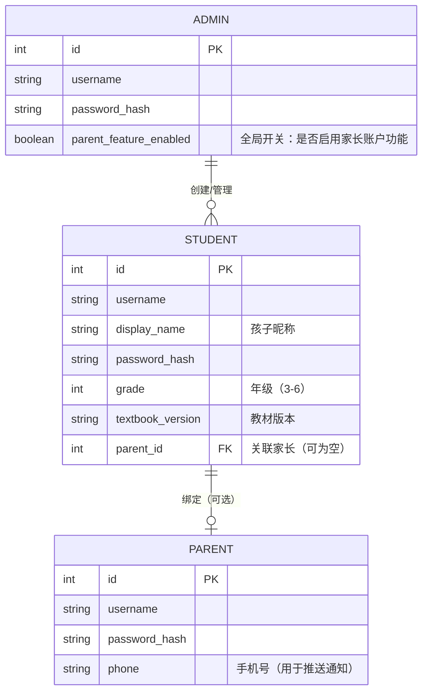
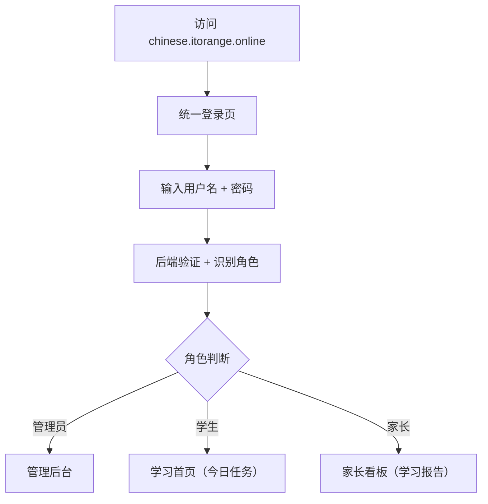
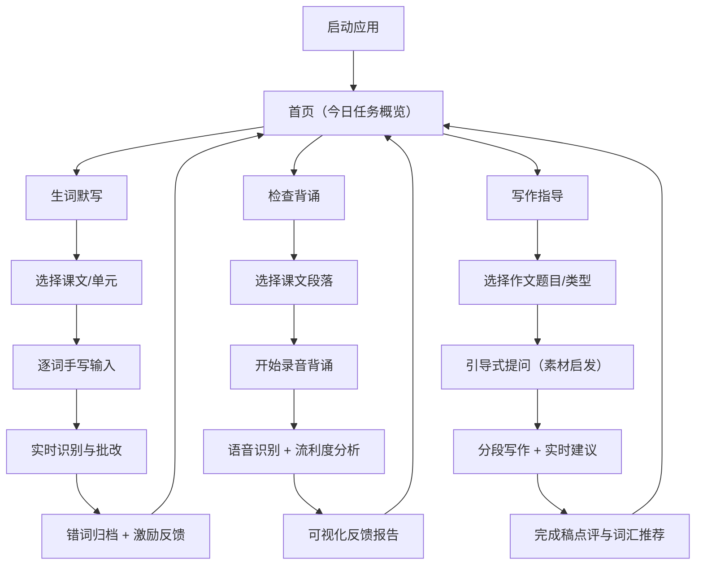
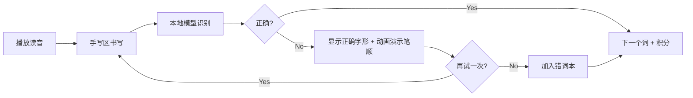
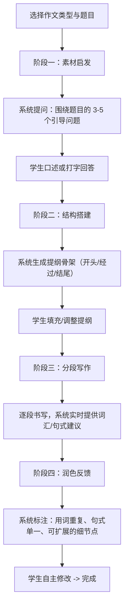
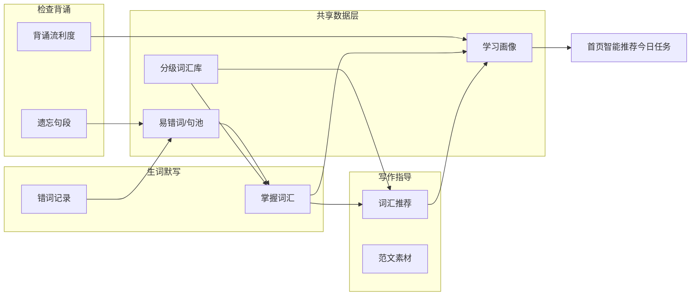
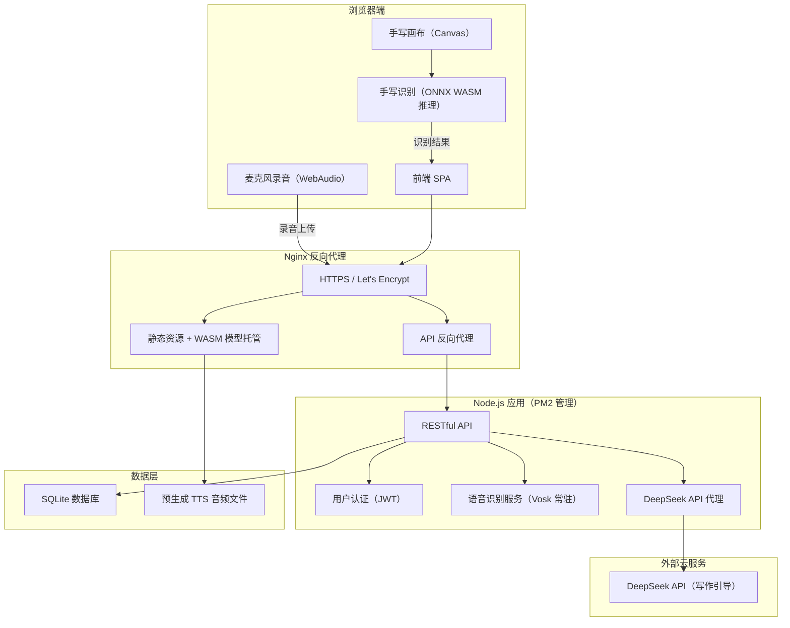
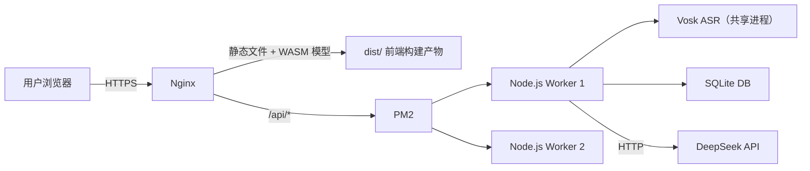

# 语文学习辅助工具 -- 产品功能设计文档

---

## 一、产品概述与核心价值

**产品定位（一句话）：** 面向小学 3-6 年级学生的课后语文自主练习工具，通过手写识别、语音分析和引导式写作，让孩子在无人辅导时也能获得即时、精准、有温度的反馈。

### 核心价值主张

- **对学生：** 练习即反馈、反馈即激励——告别"写完没人改"的低效循环。
- **对家长：** 减少逐字批改、逐段检查的辅导负担，通过报告掌握孩子薄弱点。
- **对学习效果：** 三个模块覆盖"认字 -> 记文 -> 写作"递进链路，形成完整的语文基础能力闭环。

### 用户角色与账户体系

系统支持三种角色，通过统一登录入口区分：



#### 角色权限矩阵

| 能力 | 管理员 | 学生 | 家长 |
|------|--------|------|------|
| 创建/删除学生账户 | Yes | -- | -- |
| 创建/删除家长账户 | Yes | -- | -- |
| 绑定学生与家长 | Yes | -- | -- |
| 全局开关：启用/禁用家长账户功能 | Yes | -- | -- |
| 设置教材版本、年级 | Yes | -- | -- |
| 生词默写 / 背诵 / 写作 | -- | Yes | -- |
| 查看自己的学习数据 | -- | Yes | -- |
| 查看绑定学生的学习报告 | -- | -- | Yes |
| 设置防沉迷时长 | -- | -- | Yes |
| 查看错词本/背诵详情 | -- | -- | Yes（只读） |

#### 账户管理规则

- **管理员账户：** 系统初始化时创建唯一管理员，通过后台面板（`/admin`）管理所有用户。管理员不参与学习功能。
- **学生账户：** 由管理员创建，分配用户名和初始密码。学生登录后直接进入学习首页。
- **家长账户：** 由管理员创建并绑定到对应学生。管理员可通过全局开关控制是否启用家长账户功能——关闭后，家长入口在登录页隐藏，已有家长账户暂停访问。
- **一对一绑定：** 每个学生最多绑定一个家长账户，一个家长账户可绑定多个学生（多子女场景）。
- **数据隔离：** 学生之间的学习数据完全隔离；家长仅能看到自己绑定学生的数据。

#### 登录流程



- 登录页简洁，不暴露角色选择（避免学生误入家长/管理端）。后端根据账户角色自动跳转对应界面。
- JWT Token 中包含角色信息，前端路由守卫 + 后端中间件双重校验权限。

---

## 二、用户使用流程图

### 2.1 总体导航流程



### 2.2 单次练习微循环（以生词默写为例）



---

## 三、功能详细设计

### 3.1 生词默写

#### 交互方式

| 环节 | 说明 |
|------|------|
| 词表来源 | 按教材版本（人教版等）、年级、单元组织词表；支持教师/家长自定义词表导入 |
| 出题方式 | 默认播放该词的标准读音 + 显示拼音，学生在手写区书写对应汉字 |
| 手写区域 | 全屏大格子（田字格风格），支持触屏手写与鼠标/触控笔输入 |
| 提交方式 | 书写完成后停留 1.5 秒自动提交，或点击"确认"手动提交 |

#### 识别逻辑

- **引擎选型方向：** 优先使用可离线运行的轻量手写汉字识别模型（如基于 CNN 的 HCCR 模型），打包为本地推理服务或 ONNX Runtime 嵌入。
- **识别流程：**
  1. 将手写笔迹渲染为标准化灰度图（64x64 或 96x96）。
  2. 送入本地分类模型，输出 Top-5 候选字及置信度。
  3. 若 Top-1 置信度 >= 阈值（建议 0.75）且与目标字匹配 -> 判对。
  4. 若 Top-1 非目标字但目标字在 Top-5 中 -> 提示"接近了，再写工整一些"。
  5. 若目标字不在 Top-5 -> 判错。
- **易混字处理：** 维护一张"易混字对照表"（如 己/已/巳），当识别结果命中易混字时，给出专项提示而非简单判错。

#### 错词处理机制

- **错词本：** 所有写错的词自动进入"错词本"，按错误次数排序。
- **间隔复现：** 错词在后续练习中以递增间隔重新出题（借鉴现有项目的间隔重复算法：1 -> 2 -> 4 -> 7 天）。
- **错因标注：** 系统自动标注错误类型（形近混淆 / 笔画缺失 / 完全不认识），辅助针对性复习。

#### 激励设计

- **即时反馈：** 写对时播放短促音效 + 汉字"亮起"动画；连续正确触发 combo 计数。
- **单次总结：** 每轮默写结束显示正确率、用时、进步对比（与上次同单元对比）。
- **长期激励：** 引入"汉字收集册"概念——每掌握一个生词，对应汉字卡片点亮，集满一课解锁主题徽章。

---

### 3.2 检查背诵

#### 语音判断策略

- **识别层：** 使用支持中文的语音识别引擎（如 Whisper 本地部署或 Vosk 离线模型），将学生的语音转为文字。
- **对齐层：** 将识别文本与原文进行序列对齐（基于编辑距离 / 最长公共子序列），逐句标记：
  - **完全正确：** 识别文本与原文完全匹配。
  - **替换错误：** 某个字/词被说成了另一个（标记具体位置）。
  - **遗漏：** 跳过了某句或某几个字。
  - **顺序错误：** 段落顺序颠倒。
- **流利度评估：**
  - 计算每句的语速（字/秒），与该年级参考语速对比。
  - 检测句间停顿时长：正常停顿 < 2 秒；2-5 秒标记为"卡顿"；> 5 秒标记为"长时间停顿"。
  - 综合评分 = 准确率 x 0.6 + 流利度 x 0.3 + 完整度 x 0.1。

#### 可视化反馈形式

- **逐句彩色标注：** 原文全文展示，每句根据背诵情况着色——绿色（正确）、黄色（小错误/卡顿）、红色（遗漏/大段错误）。
- **流利度时间轴：** 横轴为背诵时间线，纵轴为语速，用折线图展示背诵过程中的节奏变化，卡顿处用标记点高亮。
- **总结卡片：** 一张简洁的结果卡，包含：总准确率、流利度评级（星级）、需重点复习的句子列表。

#### 卡顿处理规则

| 停顿时长 | 系统行为 |
|----------|---------|
| < 2 秒 | 正常，不干预 |
| 2 - 5 秒 | 语音提示："不着急，想一想~"（可在设置中关闭） |
| 5 - 10 秒 | 显示下一句的前 2 个字作为提示（半透明渐入） |
| > 10 秒 | 轻声询问："要不要先看一遍原文再试？"提供"查看原文"和"继续背"两个选项 |

- 使用提示不扣分，但在反馈报告中标注"借助提示完成"，帮助家长和学生了解真实掌握程度。
- 允许学生中途暂停/重录单句，避免一处卡顿导致全篇重来的挫败感。

---

### 3.3 写作指导

**核心原则：引导思考，严禁代写。** 系统扮演的角色是"提问的老师"，而非"代笔的枪手"。

#### 引导流程



#### 启发策略（阶段一详细设计）

针对小学生写作的三大痛点，分别设计启发机制：

**痛点一：没素材（不知道写什么）**
- 系统根据作文题目生成场景化提问，引导学生回忆具体经历。
- 示例（题目"一件难忘的事"）：
  - "这件事发生在什么时候？那天天气怎样？"
  - "当时你心里是什么感觉？是紧张、开心还是害怕？"
  - "有没有一个细节让你现在想起来还印象深刻？"
- 技术实现：预置题目模板库覆盖常见题型（写人/记事/写景/状物）；对于模板未覆盖的题目，调用 LLM API 生成引导问题（仅生成问题，不生成作文内容）。

**痛点二：流水账（只会"然后…然后…然后…"）**
- 在分段写作阶段，系统检测连接词使用频率。当"然后""接着"等词出现超过 2 次时，弹出温和提示：
  - "试试换个说法？比如：'正在这时'、'没想到'、'令我惊讶的是'……"
- 同时提供"段落放大镜"功能：选中一段文字，系统提问"这里能不能加一个你看到/听到/闻到的细节？"引导学生丰富感官描写。

**痛点三：词汇匮乏（翻来覆去就那几个词）**
- 详见下方"词汇推荐逻辑"。

#### 词汇推荐逻辑

- **触发时机：** 学生写作过程中，系统实时扫描已写内容。
- **检测规则：**
  1. 同一形容词/动词在全文中出现 >= 3 次 -> 触发同义词推荐。
  2. 描写类段落中未使用任何修辞手法（比喻、拟人等）-> 弹出"修辞小贴士"。
  3. 当前段落字数明显少于年级参考值 -> 提示"这一段还可以再展开哦"。
- **推荐形式：**
  - 以"词语气泡"形式浮现在写作区侧边，学生可点击采纳或忽略。
  - 推荐词汇来源：按年级分级的词汇库（与生词默写模块共享词表），优先推荐学生已学过但未在本文使用的词。
- **红线限制：**
  - 系统永远不主动生成完整句子或段落供学生复制。
  - 词汇推荐每段最多触发 2 次，避免打断写作心流。

---

## 四、功能联动设计

三个模块不应是孤立的练习入口，而是通过数据和场景形成学习闭环：



### 具体联动场景

| 联动路径 | 描述 |
|----------|------|
| 默写 -> 写作 | 生词默写中已掌握的词汇，在写作指导的"词汇推荐"中优先出现，鼓励学以致用 |
| 写作 -> 默写 | 写作中被系统发现频繁写错的字，自动加入错词本，下次默写时重点出题 |
| 背诵 -> 默写 | 背诵中遗漏/替换的关键词，加入默写练习的"易错词"池 |
| 背诵 -> 写作 | 背诵过的课文中的好词好句，在写作时作为"修辞小贴士"的素材来源 |
| 学习画像 -> 首页 | 综合三个模块的数据，首页智能推荐当日最需要加强的练习类型和内容 |

---

## 五、技术选型与部署方案

以下为框架性建议，具体库版本和模型选择请开发团队根据实际评估确定。

### 5.1 部署目标与硬件约束

- **服务器：** 腾讯云轻量应用服务器（2 核 CPU / **4 GB 内存** / 50 GB SSD）
- **内存现状：** 系统及已有服务已占用约 948 MB，**可用内存约 3 GB**
- **域名：** `chinese.itorange.online`
- **代码仓库：** `git@github.com:earthturtle2/chinese_helper.git`
- **进程管理：** PM2
- **产品形态：** 纯 Web 应用（浏览器访问）

> **关键决策：** 4GB 内存下可用约 3GB，采用 **"浏览器端手写识别 + 服务端语音识别 + 云端 LLM"** 的混合架构。手写识别保留在浏览器端（ONNX WASM）以获得零延迟的书写体验；语音识别由服务端 Vosk 模型承担（~200-300MB），比浏览器 Web Speech API 更稳定、跨浏览器一致；写作引导通过 DeepSeek API 完成。

### 5.2 整体架构



### 5.3 各层选型方向

| 层级 | 运行位置 | 方向建议 | 备注 |
|------|---------|---------|------|
| 后端框架 | 服务端 | Node.js + Express/Fastify | PM2 管理，2 个 worker |
| 数据存储 | 服务端 | SQLite（better-sqlite3） | 同步驱动，内存占用极低，适合单实例 |
| 手写识别 | **浏览器端** | ONNX Runtime Web（WASM 后端） | 模型文件（~10-20MB CNN）作为静态资源加载到浏览器，书写即识别零延迟 |
| 语音识别 | **服务端** | Vosk 中文离线模型 | 前端录音上传，服务端转写；模型常驻内存约 200-300MB；跨浏览器一致、可自主控制精度 |
| TTS（读音播放） | Nginx 静态 | 预生成 mp3 文件 | 小学词表约 2000-3000 词，全量预生成音频约 100-200MB，Nginx 直接托管 |
| 写作引导 LLM | 云端 API | DeepSeek API | 服务端代理转发 + 内容安全过滤；生成引导问题和词汇推荐 |
| 前端框架 | 浏览器端 | React 或 Vue（SPA）| 触屏适配是重点；需支持 WASM 加载和 WebAudio 录音 |
| 前端手写画布 | 浏览器端 | HTML Canvas API | 采集笔迹渲染为灰度图后直接在浏览器内送入 ONNX 推理 |

#### 为什么手写识别在浏览器而语音识别在服务端？

| 维度 | 手写识别 -> 浏览器端 | 语音识别 -> 服务端 |
|------|---------------------|-------------------|
| 延迟敏感度 | 极高——笔画完成后需 <200ms 出结果才流畅 | 中等——背诵完成后等 1-2 秒可接受 |
| 模型大小 | CNN 模型仅 10-20MB，浏览器 WASM 可轻松加载 | Vosk 中文模型 50-200MB，浏览器端加载过重 |
| 浏览器兼容性 | ONNX WASM 兼容性好（Chrome/Edge/Safari/Firefox） | Web Speech API 各浏览器实现差异大，中文识别质量不稳定 |
| 后处理复杂度 | 简单——对比目标字即可 | 复杂——需逐句对齐、计算停顿时长、流利度评分，服务端更方便 |

### 5.4 部署架构与运维



#### 服务器内存预算（总计 4096 MB）

| 占用方 | 预估内存 | 说明 |
|--------|---------|------|
| 系统 + 已有服务 | ~948 MB | 当前实际占用（升级内存后不变） |
| Nginx | ~30-50 MB | 静态文件托管 + 反向代理 |
| Vosk 中文语音模型 | ~200-300 MB | 常驻内存，加载后所有请求复用；推荐使用 vosk-model-small-cn（~50MB 模型文件，运行时 ~200MB） |
| Node.js 应用 x2 | ~400-600 MB | 2 个 worker，每个约 200-300MB（含 Express/Fastify + SQLite + API 逻辑） |
| 系统文件缓存/余量 | ~2.1-2.5 GB | Linux 页面缓存 + 突发请求余量，非常充裕 |

> **内存安全线：** 应用总占用约 1.6-1.9 GB，加上已有服务约 2.5-2.9 GB，占总内存 60-70%。剩余 1.1-1.5 GB 作为系统缓存和安全余量，健康合理。

#### 磁盘空间预算（总计 50 GB SSD）

| 占用方 | 预估大小 | 说明 |
|--------|---------|------|
| 系统 + 已有服务 | ~10-15 GB | 操作系统、已安装软件 |
| Node.js + node_modules | ~200-500 MB | 应用依赖 |
| Vosk 中文模型文件 | ~50-200 MB | small-cn 约 50MB；如需更高精度可用中等模型约 200MB |
| 前端构建产物 + WASM 模型 | ~50-100 MB | 含 ONNX 手写识别模型 |
| TTS 预生成音频 | ~100-300 MB | 按 3000 词估算 |
| SQLite 数据库 | ~10-100 MB | 用户学习数据，增长缓慢 |
| 日志 | ~100 MB（配轮转上限） | PM2 + Nginx 日志 |
| 余量 | ~33-39 GB | 充足 |

#### Nginx 配置要点

- 监听 443 端口，TLS 证书通过 Let's Encrypt (certbot) 自动签发与续期
- `chinese.itorange.online` 静态资源请求指向前端构建目录
- WASM 和 ONNX 模型文件配置正确的 MIME type 和长缓存（`Cache-Control: max-age=2592000`），更新时通过文件名哈希破缓存
- `/api/*` 路径反向代理到 Node.js 应用（默认 `127.0.0.1:3000`）
- 开启 gzip/brotli 压缩（WASM 文件压缩率可达 60-70%）
- 配置 `client_max_body_size 10m`，支持背诵录音上传（一段 3 分钟背诵约 1-3MB）

#### PM2 配置要点

- 使用 `ecosystem.config.js` 管理进程
- 运行 **2 个 worker**（instances: 2），提升并发处理能力
- 设置 `max_memory_restart: '350M'`，防止单进程内存泄漏
- 配置 pm2-logrotate（单文件上限 10MB，保留 7 份）
- 配置 `pm2 startup` 实现服务器重启后自动拉起
- 建议 `node_args: '--max-old-space-size=300'` 限制 V8 堆内存

#### Vosk 语音识别服务部署

- **部署方式：** 作为独立子进程或 Node.js 原生 addon 加载 Vosk 模型，Node.js 主进程通过进程间通信调用
- **模型选择：** 推荐 `vosk-model-small-cn-0.22`（文件 ~50MB，运行时 ~200MB），在 2 核 CPU 上可实现接近实时的转写速度
- **并发处理：** 小学生使用场景并发量低（预估峰值 < 10 人同时背诵），单个 Vosk 实例通过请求队列即可应对
- **超时保护：** 单次语音识别设置 60 秒超时，超过则返回已处理部分的结果

#### HTTPS 与域名

- 域名 `chinese.itorange.online` 解析 A 记录指向轻量服务器公网 IP
- 使用 certbot + Nginx 插件自动申请 Let's Encrypt 证书
- 强制 HTTP -> HTTPS 301 跳转
- HTTPS 是麦克风录音（WebAudio/getUserMedia）的前提条件

#### Git 部署流程

**代码仓库：** `git@github.com:earthturtle2/chinese_helper.git`

**服务器初始化（首次部署）：**

1. 服务器生成 SSH 密钥并添加到 GitHub 账户的 Deploy Keys（只需读取权限）
2. 克隆仓库到部署目录：`git clone git@github.com:earthturtle2/chinese_helper.git /opt/chinese_helper`
3. 安装依赖：`cd /opt/chinese_helper && npm install --production`
4. 复制环境配置：`cp .env.example .env` 并填写 DeepSeek API Key 等敏感信息（`.env` 已加入 `.gitignore`）
5. 启动服务：`pm2 start ecosystem.config.js && pm2 save`

**日常更新（后续部署）：**

```
cd /opt/chinese_helper
git pull origin main
npm install --production
pm2 restart ecosystem.config.js
```

建议将上述步骤封装为 `scripts/deploy.sh`，一键执行。

**推荐的分支策略：**

| 分支 | 用途 |
|------|------|
| `main` | 生产分支，服务器部署此分支；仅通过 PR 合入 |
| `dev` | 开发主分支，日常开发在此进行 |
| `feature/*` | 功能分支，完成后合入 `dev` |

**可选：GitHub Actions 自动部署**

在仓库中配置 `.github/workflows/deploy.yml`，当 `main` 分支收到 push 时，通过 SSH 远程执行服务器上的 `scripts/deploy.sh`，实现代码推送即自动上线。初期可不配置，手动部署即可。

### 5.5 前后端协作策略

核心原则：**手写识别在浏览器端追求零延迟，语音识别在服务端追求高质量，LLM 通过云 API 按需调用。**

- **手写识别（浏览器端）：** 前端加载 ONNX WASM 模型（首次约 10-20MB，Service Worker 缓存后不再请求）。用户在 Canvas 上书写完成后，前端将笔迹渲染为标准灰度图，直接在浏览器内推理，<200ms 出结果。仅将结论性数据（对/错/识别为哪个字）通过 API 发送到后端存储。
- **语音识别（服务端 Vosk）：** 前端通过 WebAudio API 录制用户背诵音频（opus/webm 编码以减小体积），录音结束后上传至 `/api/asr` 接口。服务端 Vosk 模型转写后，在同一请求中完成逐句对齐、停顿检测、流利度计算，将结构化评分结果返回前端渲染。整个过程用户等待约 2-5 秒（取决于音频时长）。
- **数据同步：** 练习结果（正确率、错词、背诵评分等结构化数据）通过 REST API 提交到后端持久化，数据量极小（每次请求 < 1KB）。
- **LLM 调用：** 写作模块的引导问题生成通过后端代理转发至 DeepSeek API，服务端负责请求转发、内容安全过滤和结果缓存（相同题目的引导问题可缓存复用）。
- **TTS 音频：** 以静态文件方式由 Nginx 直接提供，Node.js 不参与音频请求处理。

---

## 六、非功能性需求

### 6.1 护眼设计

- 默认启用护眼色温模式（暖色调背景，避免纯白底色）。
- 单次连续使用 25 分钟后弹出休息提醒（番茄钟式），含趣味眼保健操动画引导。
- 字体大小不低于 18px（正文），关键信息（如错词提示）使用 22px 以上。
- 支持夜间模式自动切换（跟随系统或定时）。

### 6.2 防沉迷机制

- 系统默认每日使用时长上限 40 分钟/天。
- 若已绑定家长账户，家长可在家长看板中自定义该学生的时长上限（20-60 分钟可调）。
- 若未绑定家长账户，使用系统默认值，管理员可在后台调整默认值。
- 达到时长上限后，温和提示"今天的学习任务已经完成啦，明天再来！"并锁定功能。
- 不设计任何"付费解锁更多时间"的机制——这是教育工具，不是游戏。

### 6.3 家长端（独立账户登录）

家长通过独立账户登录系统，进入专属的家长看板，与学生端完全分离。

**前提条件：** 管理员已开启家长账户功能（全局开关），且为该家长创建了账户并绑定了学生。

**家长看板功能：**

- **今日概览：** 绑定学生今日是否已练习、练习时长、各模块完成情况（一目了然的状态卡片）。
- **每日简报：** 默写正确率、背诵完成篇目与评分、写作进展。
- **周度分析：** 本周高频错字 Top 5、背诵流利度趋势图、写作中被提示最多的问题类型。
- **错词本查看：** 只读查看孩子的错词本，了解哪些字反复出错。
- **防沉迷设置：** 家长可设置每日使用时长上限（覆盖默认值）。
- **多子女切换：** 若绑定了多个学生，顶部 tab 切换查看不同孩子的数据。

**报告语气原则：** 正面导向，强调进步而非不足（如"本周比上周多掌握了 12 个生词"而非"还有 30 个词未掌握"）。

### 6.4 内容安全

- 写作模块中 LLM 的输出须经过内容过滤，确保不出现不适合儿童的内容。
- 语音识别结果不持久存储原始音频，仅保留文字转写结果。
- 所有学习数据本地存储优先；如有云同步，须加密传输且符合儿童数据保护法规。

### 6.5 无障碍与包容性

- 支持语音播报所有界面文字（辅助视力较弱的学生）。
- 手写识别对左撇子书写的笔顺差异有容忍度。
- 错误反馈措辞温和，禁用任何负面标签（如"差""不及格"），统一使用鼓励性表达（如"还差一点点""再试一次一定行"）。

---

## 附录：快速启动与项目结构

### 开发环境

```bash
# 1. 安装依赖
npm install
cd client && npm install && cd ..

# 2. 配置环境变量
cp .env.example .env
# 编辑 .env 填写 JWT_SECRET、ADMIN_PASSWORD 等

# 3. 初始化数据库
npm run db:init

# 4. 启动后端（开发模式）
npm run dev

# 5. 启动前端（另一个终端）
npm run client:dev
```

浏览器访问 http://localhost:5173，默认管理员账户见 `.env` 中的配置。

### 项目结构

```
chinese_helper/
├── server/                 # Node.js 后端
│   ├── index.js            # 入口
│   ├── config.js           # 配置
│   ├── db/                 # 数据库
│   │   ├── schema.sql      # DDL
│   │   └── init.js         # 初始化
│   ├── middleware/          # 中间件
│   │   ├── auth.js         # JWT 认证
│   │   └── usageTracker.js # 防沉迷
│   └── routes/             # API 路由
│       ├── auth.js         # 登录
│       ├── admin.js        # 管理后台
│       ├── dictation.js    # 默写
│       ├── recitation.js   # 背诵
│       ├── writing.js      # 写作
│       └── parent.js       # 家长端
├── client/                 # React 前端
│   └── src/
│       ├── api.js          # API 调用层
│       ├── context/        # 全局状态
│       ├── components/     # 公共组件
│       └── pages/          # 页面
│           ├── admin/      # 管理后台
│           ├── student/    # 学生端
│           └── parent/     # 家长端
├── ecosystem.config.js     # PM2 配置
├── scripts/                # 部署脚本
│   ├── deploy.sh           # 一键部署
│   └── nginx.conf.example  # Nginx 配置模板
└── data/                   # 数据（.gitignore）
```
